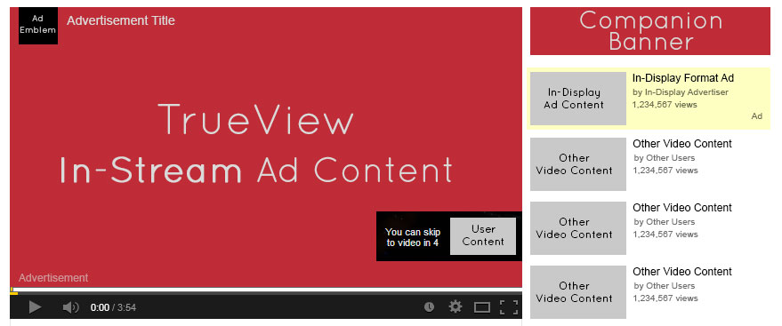

# Youtube adview prediction
A Machine Learning project for Machine Learning Internship offered by [InternshipStudio](https://internshipstudio.com/).

## 📌**Objective**
To build a machine learning model which will predict youtube adview count based on other youtube metrics.
## 📁 **Data Description**
- train.csv - the training set
- test.csv - the test set
- The file train.csv contains metrics and other details of about 15000 youtube videos. The metrics include number of views, likes, dislikes, comments and apart from that published date, duration and category are also included. The train.csv file also contains the metric number of adviews which is our target variable for prediction. 
  
## ⚠️**TechStack/framework used**
- Machine Learning
- GradientBoostingRegressor
- XGBRegressor
- LGBMRegressor
- StackingRegressor
- Lasso
- Ridge
- Optuna

## ❤️**Owner**
Made With ❤️ by [Sidharth kumar mohanty](www.linkedin.com/in/sidharth178)

## 😖Troubleshoot
Any issues??? Feel free to ask.[Linkedin](www.linkedin.com/in/sidharth178)

If you find this repo useful,don't forget to give a ⭐
